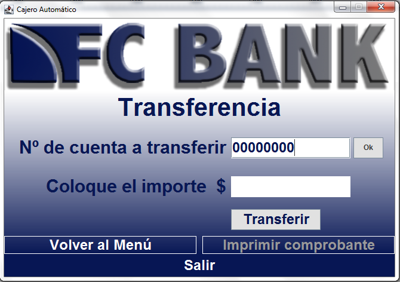

# cajero-ATM
Programa simple con las funciones más importantes de un cajero automático (ATM) perteneciente a la entidad ficticia FC Bank
(cualquier relación de este nombre con la realidad es pura coincidencia)

El proyecto consta de seis ventanas o interfaces gráficas. Cada una de ellas, aunque no esté conectada a una base de datos real, 
fue pensada con la idea de emular el funcionamiento básico de un cajero automático, con la simplicidad y rapidez que 
deberían caracterizar a los mismos. Las operaciones lógicas son realizadas mediante la ayuda de una clase llamada GestorCuenta
cuyo objetivo es crear una cuenta bancaria ficticia con dinero disponible de forma predeterminada para que el usuario pueda
operar con él, hacer uso y testear las funciones de este programa, las cuales consisten en: ver el saldo, poder extraer dinero, 
poder depositar dinero y poder realizar transferencia ficticias.

Las interfaces gráficas mencionadas son:

- Ventana Inicio:
  Ventana con la que se "arranca" el programa. En un cajero automático común, en esta ventana solo se insertaría el número de PIN
  luego de haber insertado la tarjeta a la máquina, pero como aquí solo se está emulando el comportamiento de un cajero, hacemos
  que el usuario inserte tanto un número de cuenta bancaria como su PIN correspondiente imaginario.
 
- Ventana Menú:
  Una vez hecho el ingreso a la cuenta ficticia, el usuario accede a una interfaz con un menú para que elija qué acción desea realizar
  con el dinero disponible en la cuenta. Dicho dinero se inicializa de manera imaginaria y predeterminada en $ 50.000 a través de la clase 
  GestorCuenta ubicada en el fichero del mismo nombre.
  
- Ventana Saldo:
  En esta nueva interfaz, el usuario puede acceder a la información sobre el dinero disponible en la cuenta, el cual se actualiza 
  automáticamente tras cualquier operación mediante la clase GestorCuenta.
    
- Ventana Extracción:
  En esta interfaz, el usuario puede extraer una determinada cantidad de dinero de su cuenta ficticia, de la misma forma en que 
  ocurriría en un cajero automático.

- Ventana Depositar:
  En esta interfaz, el usuario puede depositar una determinada cantidad de dinero en su cuenta ficticia.

- Ventana Transferencia:
  En esta interfaz, el usuario puede transferir a una cuenta imaginaria una determinada cantidad de dinero de su cuenta ficticia.

Pueden probar la ejecución del programa a través del archivo JAR ejecutable "ATM-FCBank (jar ejecutable)" que se encuentra en el repositorio.
Tengan en cuenta que en este archivo, para que sea más interactivo que la versión original, la clase GestorCuenta agrega en cada ingreso una cantidad de dinero 
disponible diferente mediante Math.random()
  
  //--------------------VENTANA INICIO----------------------//
  
  
  
  //--------------------VENTANA MENÚ----------------------//
  
   
   
   //--------------------VENTANA SALDO----------------------//
    
   
  
   //--------------------VENTANA EXTRACCIÓN----------------------//
   
   
    
   //--------------------VENTANA DEPOSITAR----------------------//
   
   
    
   //--------------------VENTANA TRANSFERENCIA----------------------//
   
   
   
